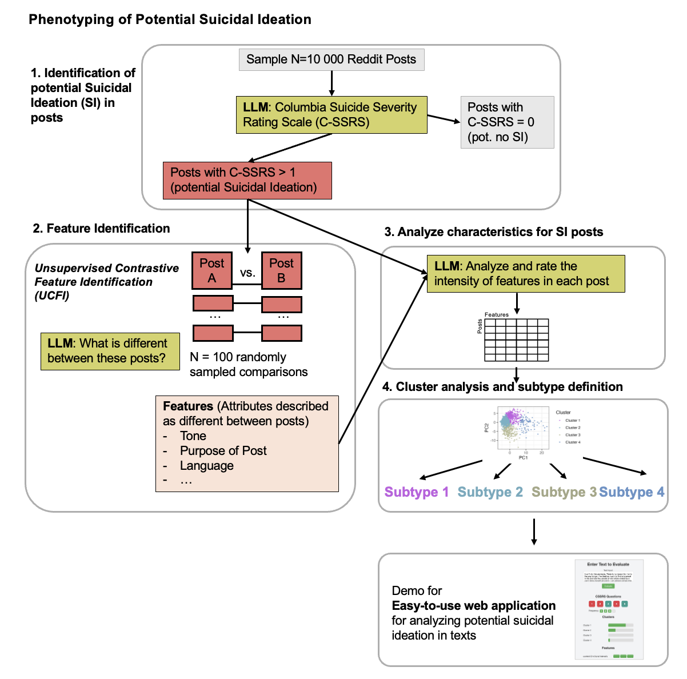

# Characterizing Suicidal Ideation Subtypes in Social Media Posts via Unsupervised Contrastive Feature Identification





## Overview

This project was conducted by a team participating in the [2024 MDplus Datathon](http://ai.mdplus.community/datathon/2024) and aims to address a real-world healthcare problem utilizing Large Language Models.

The objective of this study is to 
- 1) characterize the heterogeneity of suicidal ideation in social media posts by defining subtypes of suicidal ideation, and
- 2) develop an easy-to-use application for analyzing suicidal ideation in text posts.


### 1. Characterization of Heterogeneity of Suicidal Ideation

- Code for this analysis is located in code/mainanalysis, which includes:
	•	Python scripts for accessing and interacting with Large Language Models (LLMs)
	•	R scripts for downstream analyses and data visualization

### 2. Easy to use Web interface tool 

- Code for the web-based application is located in code/demo_application, providing:
	•	Application scripts, templates, and configuration files for deployment


## File Structure

```
project-root
│
├── code/
│   ├── mainanalysis/
│   │   ├── config.py
│   │   ├── downstream_analyses.R
│   │   ├── functions.py
│   │   ├── main.py
│   │   ├── readme_analysisisworkflow.md
│   │   └── utils.py
│   │
│   ├── demo_application/
│   │   ├── api.py
│   │   ├── app.py
│   │   ├── docker-compose.yml
│   │   ├── Dockerfile
│   │   ├── features.csv
│   │   ├── prompts/
│   │   ├── templates/
│   │   │   └── index.html
│   │   ├── README.md
│   │   └── requirements.txt
│   │
├── data/
│   ├── categories_comparisons.csv
│   ├── example_definitions.csv
│   ├── feature_definitions_final.csv
│   ├── filtered_top10_categories.json
│   ├── si_dataset_1k.csv
│   ├── top_markers.csv
│   └── graphial_abstract.png
│
└── README.md
```


# 
2024
