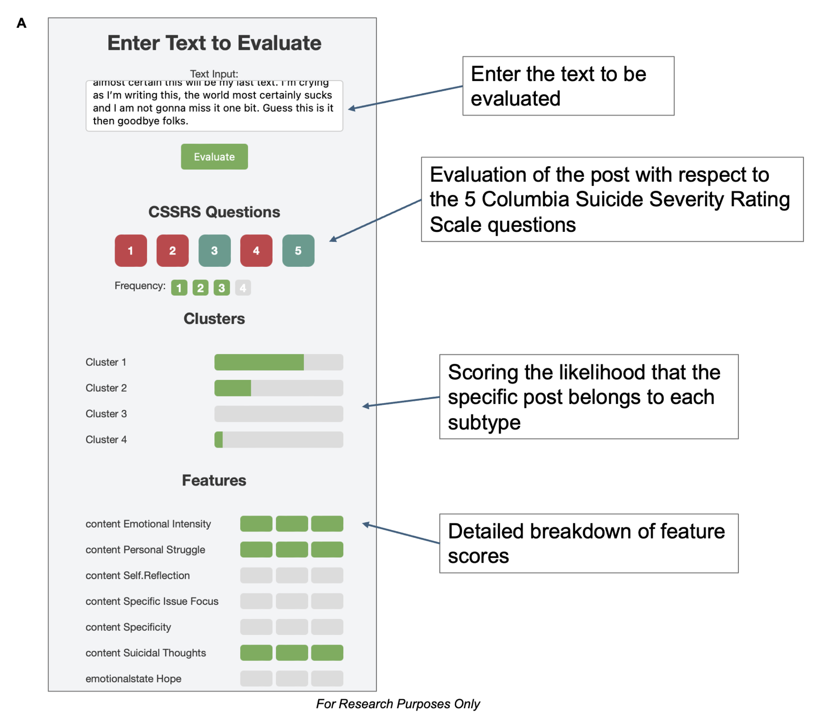

# Demo Web interface to evaluate other posts and texts

Access the demo application [here](https://icfx.de/cssrs_demo/)!





## Run using docker compose

### Build and run
```bash
docker compose up
```

### Open browser and go to `http://127.0.0.1:5001`

## Run manually

### Create virtual environment (optional)
```bash
python3 -m venv venv
```

### Activate virtual environment (optional)
```bash
source venv/bin/activate
```

### Install requirements
```bash
pip install -r requirements.txt
```

### Start flask server
```bash
./app.py
```

### Open browser and go to `http://127.0.0.1:5001`
